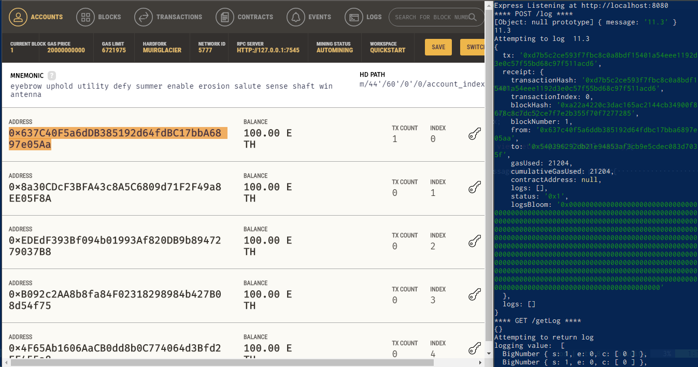

= Socrates Block Chain

This is the Blockchain component of the Socrates Online Voting System. 
It's a logger API that registers each voting attempt on the Ethereum Blockchain using Solidity contracts.

For testing purposes, we used Ganache.

